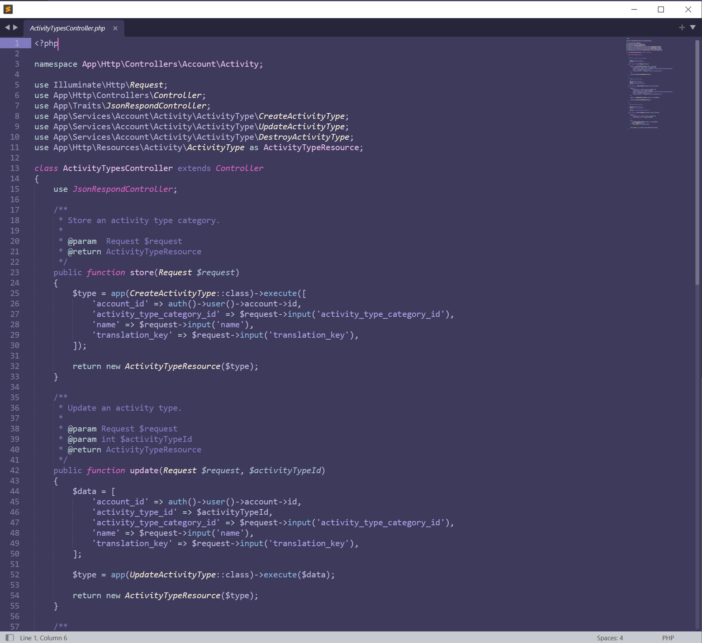

# Berry Boom

Colour scheme for Sublime Text.

## Installation

### Install using Git

1. In Sublime Text go to `Preferences -> Browse Packages...` and start a Terminal window.

1. Clone the repository using the command below:

    ```bash
    git clone https://github.com/nefydev/berryboom.git "BerryBoom"
    ```

### Install manually

1. Download the GitHub .zip
1. Unzip the files and rename the folder to `BerryBoom`.
1. In Sublime Text go to `Preferences -> Browse Packages...` and copy the folder into.

## Activating

In Sublime Text go to  `Preferences -> Select Color Scheme` and select `BerryBoom` option.

## Preview



## License

The MIT License (MIT). Please see [License File](LICENSE.md) for more information.

## Support

[](https://ko-fi.com/E1E5BQUXC)